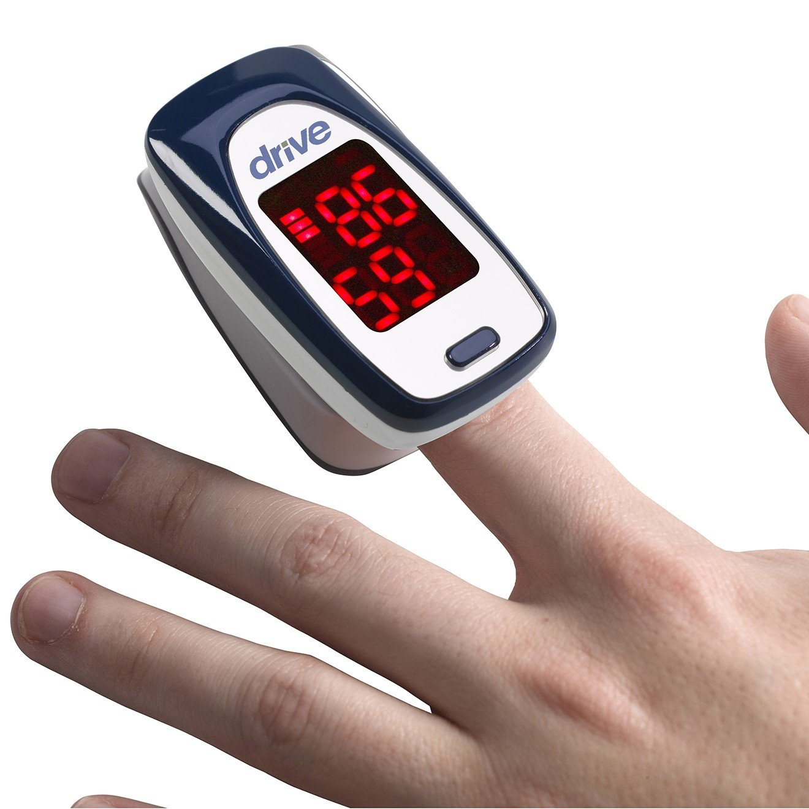

# Pulse Oximeter

## What is a Pulse Oximeter and What Does it Do

Imaged above is a standard finger pulse oximeter. Pulse oximeters are often abreviated to Pulse Ox and will be for the rest of this document. 

The purpose of a Pulse Ox is to non-invasively measure the [blood oxygen](/Medical_Devices/related_terms/blood_oxygen.md) level of the user.

## How Does A Standard Pulse Oximeter Work

## Bibliography